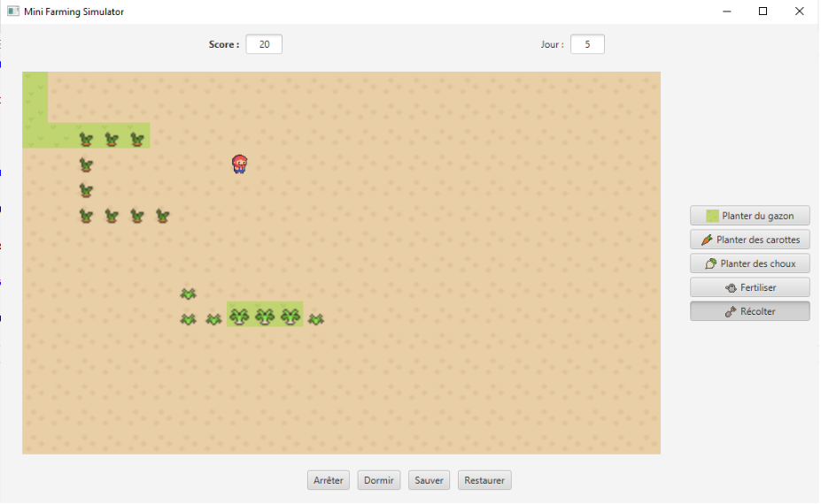

# Desktop Farming Game Application
A desktop game application inspired by farming simulation games, where the player manages and develops a farm by cultivating crops and producing food, with the ultimate goal of making the farm flourish and achieving a specific level of success.

A classic example of this genre is Stardew Valley.

## Technologies
* Java 17
* JavaFX 19

## architecture & patterns
* MVVM
* Implementation memento design pattern.


## App

### Plants and Crops

The plants we grow evolve over time, with time being measured in days. In our application, a new day begins when the farmer "sleeps."

#### Various Crops to Grow

Each vegetable has different growth durations and yields. The growth time for some vegetables may vary depending on whether they are planted on grass or not.

**Notes:**

- Grass can be added after a vegetable is planted. In this case, the grass will be placed "beneath" the vegetable.
- You cannot plant a vegetable on a plot if another vegetable is already there. In such cases, planting has no effect.

In this iteration, we focus on two types of vegetables. For each one, we define their growth stages, the impact of fertilization or grass on their growth, and their yield (measured in points gained at each growth stage).

**Note:** The "Rot" stage has a specific duration. After this period, the vegetable will automatically disappear, and a "harvest" will occur, resulting in a point loss (see **Rot Calculation**).

#### Carrots

Grass has no effect on carrots. Whether planted on grass or not, the growth and yield of the carrot remain unchanged. However, fertilization does affect their growth.

The maximum yield of a carrot is 100 points.

| Growth Stage         | Duration (days) | Effect of Fertilization | Points Gained/Lost at Harvest |
|----------------------|-----------------|-------------------------|--------------------------------|
| Stage 1 (Planting)    | 3               | Immediately advances to Stage 3 | 1/10 of max yield |
| Stage 2               | 3               | Immediately advances to Stage 3 | 1/5 of max yield |
| Stage 3               | 3               | No effect               | 1/2 of max yield |
| Stage 4               | 3               | No effect               | Max yield |
| Rot                   | 10              | No effect               | See **Rot Calculation** |

#### Cabbages

For cabbages, the situation is reversed: fertilization has no effect, but planting cabbages on grass speeds up their growth.

The maximum yield of a cabbage is 200 points.

| Growth Stage         | Duration (days) without grass | Duration (days) with grass | Points Gained/Lost at Harvest |
|----------------------|------------------------------|---------------------------|--------------------------------|
| Stage 1 (Planting)    | 5                            | 4                         | 0 points                      |
| Stage 2               | 4                            | 3                         | 0 points                      |
| Stage 3               | 3                            | 2                         | 3/4 of max yield              |
| Stage 4               | 2                            | 1                         | Max yield                     |
| Rot                   | 10                           | 5                         | See **Rot Calculation**        |

#### Rot Calculation

When harvesting a vegetable in the "Rot" stage, points are lost according to the following formula:

```
points_lost = 1/10 * max_yield * (harvest_day - first_day_of_rot_stage)
```

**Example:** If a carrot is harvested 2 days after it entered the "Rot" stage, the point loss would be:

```
1/10 * 100 * 2 = 20 points lost
```

#### Grass Behavior

Grass remains in the same state but is automatically harvested 12 days after being planted. Harvesting grass, whether manually or automatically, does not yield any points.

### memento
The complete game state can be saved at any point during the game, allowing the player to return to that exact moment later. This state will be stored in memory (not on disk) using the Memento design pattern, which helps manage and restore complex game states efficiently.

The "complete state" refers to all aspects of the game that define its current situation. This includes the content of each cell on the farm, the growth stage of every crop, the farmer's position on the map, the current in-game day, and the number of points accumulated at the time of the save. The Memento pattern allows the game to capture and store these elements without altering the game's core functionality, providing a seamless way to restore the game to a specific moment in time whenever needed.

### start game


### before clicking save (state day 5)


### after clicking save (state day 5)


### game day 11


### restore state (day 5)
